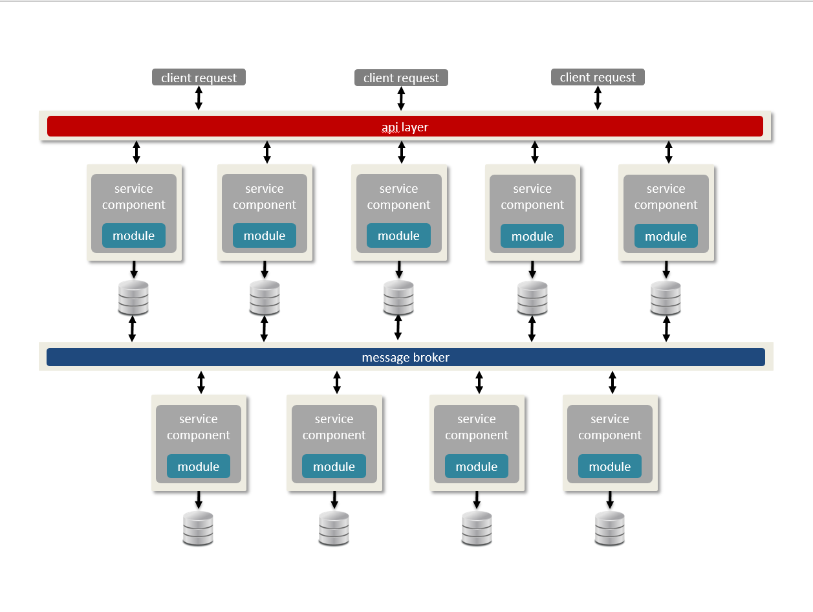

## Module I - An Overview of the DaaS Pattern

Data as a Service is an agile architecture pattern that allows real-time data provisioning, adherence to the principles of the [last responsible moment (LRM)](lrm.md), and facilitates the delivery of the Minimal Viable Product (MVP).

---

### Section I

