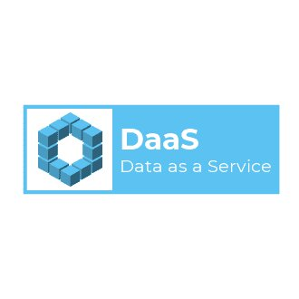

# Data as a Service Workshop

## Objective
> The goal of this workshop is to provide participants with the hands-on experience to build out a DaaS architecture pattern.

In this workshop you will learn: 
+ Overview of the DaaS pattern
+ Overview of the Rust language
+ How to create RESTful services in Rust
+ How to broker the events using Kafka
+ How to provide data analytics as a service

---

**IMPORTANT**
Prior to starting the workshop, make sure 

+ you have a laptop for developing on
+ have internet connection
+ have successfully installed the Rust Toolchain, Kafak, and CouchDB

## Developer Slice Setup
- [Rust Language](../docs/reference-rust.md)
- [CouchDB](../docs/reference-couchdb.md)
- [Kafak](../docs/reference-kafka.md)
- [Postman](./docs/reference-postman.md)