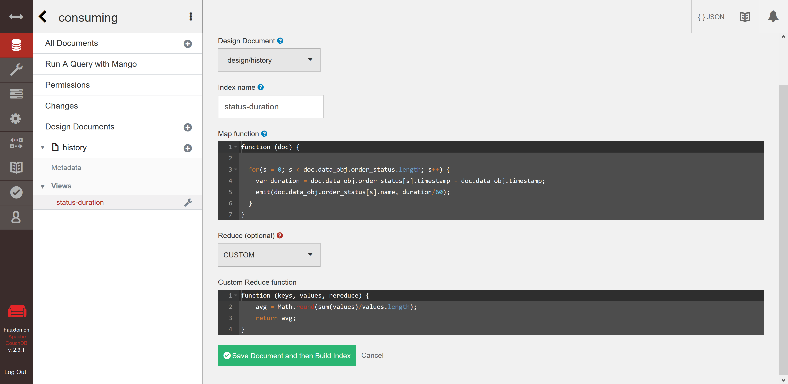

# Data as a Service Workshop

## Objective
> The goal of this workshop is to provide participants with the hands-on experience to build out a DaaS architecture pattern.

In this workshop you will learn: 
+ Overview of the DaaS pattern
+ Overview of the Rust language
+ How to create RESTful services in Rust
+ How to broker the events using Kafka
+ How to provide data analytics as a service

---

**IMPORTANT**
Prior to starting the workshop, make sure 

+ you have a laptop for developing on
+ have internet connection
+ have successfully installed the Rust Toolchain, Kafak, and CouchDB

## Developer Slice Setup
- [Rust Language](../docs/reference-rust.md)
- [CouchDB](../docs/reference-couchdb.md)
- [Kafak](../docs/reference-kafka.md)

### More Material
+ [Rust related references](../docs/reference-material.md)

## Module I
+ [_Overview of the DaaS Pattern_](module-01/daas-pattern.md)

## Module II
+ [_Building a Rust Project_](module-02/build-rust-project.md)

## Module III
_Creating a RESTful service to source event data_
1. Build a data sourcing RESTful endpoint
2. Making a parameterized resource path
3. Adding authentication

## Module IV
_Creating a DaaS module_
1. make_id()
2. DaaSDoc struc
3. DaaSDocNoRev struc
4. implement DaaSDoc

## Module V
_Creating a CouchDB module_
1. CouchDB struc
2. implement CouchDB
   
## Module VI
_Creating a Kafka broker module_
1. get_properties_path()
2. get_run_cmd()
3. produce_message()
4. run_cmd_with_properties()
5. run_cmd_without_properties()
6. start_zookeeper() / stop_zookeeper()
7. start_kafka() / stop_kafka()

## Module VII
_Creating a data provisioning processor for managing order status metrics_
1. OrderStatusProcessor struc
2. implement OrderStatusProcessor
3. replace stub for sourcing::process_data()

## Module VIII
_Creating a RESTful service to service up order status metrics_
1. CouchDB view 
   
2. Build a data service RESTful endpoint for metrics
