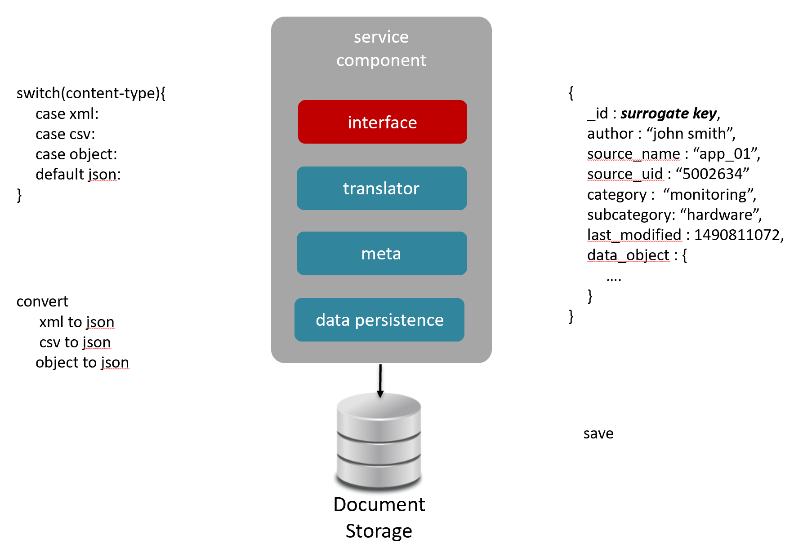
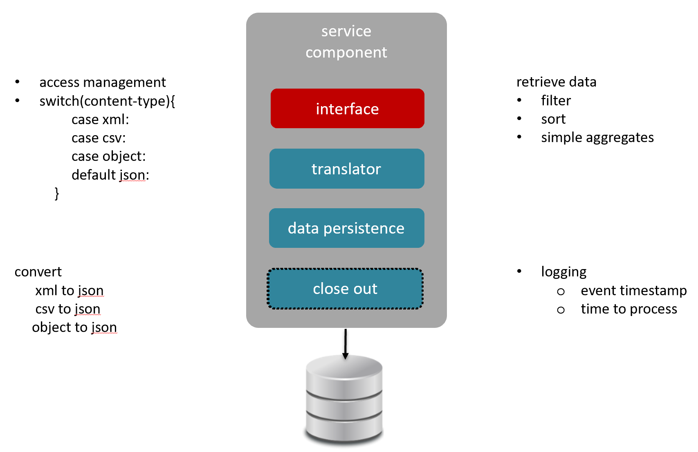

## Module I - An Overview of the DaaS Pattern

Data as a Service is an agile architecture pattern that allows real-time data provisioning, adherence to the principles of the [last responsible moment (LRM)](lrm.md), and facilitates the delivery of the Minimal Viable Product (MVP).

---

### Section I
The DaaS architecture provides the agility to scale and adapt the sourcing, provisioning, and publishing of the data using a combination of the microservice pattern and plugin model. 

+ By sourcing the data through an adaptive layer, we are able to loosely couple our data source from the provisioning. 
+ Using an eventing model removes the process dependency of the data records (unbundled)
+ Applying a plugin model provides self-orchestrated workflow as well as the agility to change our provisioning with the least amount of impact
+ Placing a service-based layer between the data consumers and the provisioned data, provides the flexibility to support consumer based contracts (e.g.: security, error handling, scope of dataset) 

### Section II
In order to support real-time provisioning we first need to support real-time sourcing. To do this, we use a RESTful endpoint that is designed to ...

1. be autonomous to the schema of the data being sourced
2. dynamically construct meta data based on the source of the data
3. ensure delivery of the sourced data to the provisioning engine
   

### Section III
Provisioning logic will be forever changing, so we need to ...

1. ensure that process is no brittle
2. the workflow is self-guided
3. data records are not tightly coupled

### Section IV
Just like the provisioning of the data, the "how and what" is consumed is never static. The connection method (e.g.: web service, database connection, client), the scope of the data, and the applied criteria (e.g.: security, filters, formats) require flexibility of the architecture with shortened Mean Time To Deliver (MTTD).

