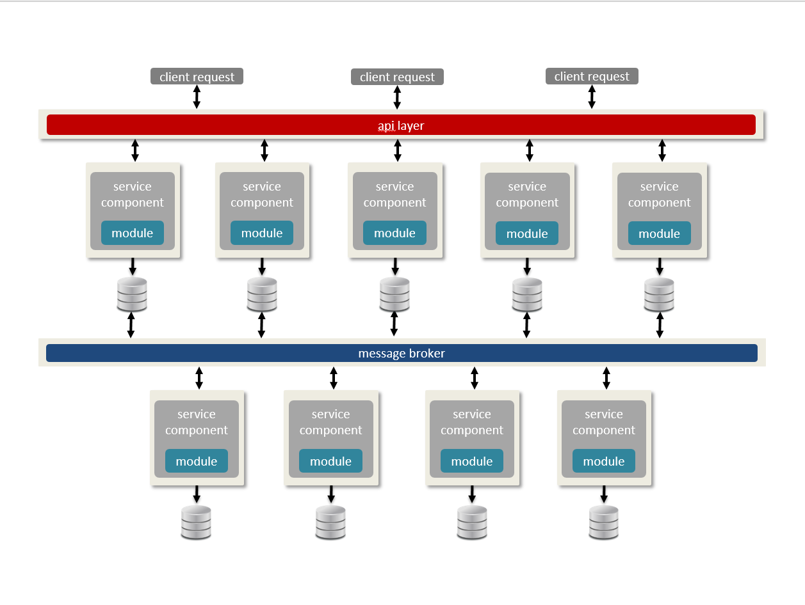

## Module III - Building the Dependent Modules

Before we begin constructing our first RESTful service for the DaaS Pattern, we need to first review the architecture overview of the DaaS Pattern. We see in the pattern that our DaaS services interact with a **database**, (we will be using CouchDB) and a **broker** (we will be using Kafka). There is also a **data pattern**, (a metadata data model) that causes the DaaS pPattern to become a reactive architecture. 

Based on these system interactions, and applying Object Oriented Design, we quickly realize that we will first need to construct 3 modules:

1. daas
2. couchdb
3. broker

Each of these modules will act as abstraction layers for our services to interact with the infrastructural components.  